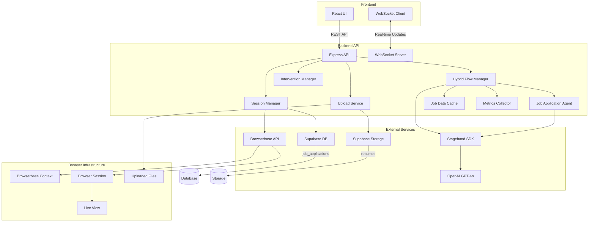

# LinkedIn Automation Backend Architecture

## System Overview

This document outlines the complete backend architecture for the LinkedIn automation system using Stagehand + Browserbase, providing multi-tenant browser automation with human-in-the-loop intervention capabilities.

## Updated Architecture (Hybrid act()/agent() Approach)

The system now uses a hybrid approach combining Stagehand's `act()` for deterministic navigation and `agent()` for complex form filling, providing:
- Real-time progress updates
- Rich frontend responses
- Efficient caching
- Comprehensive metrics
- Support for both Easy Apply and external applications

## Architecture Diagram



## Core Components

### 1. **LinkedInAutomationService** (`linkedinAutomationService.ts`)
Main service orchestrating the automation process:
- Manages Stagehand instances
- Handles session lifecycle
- Coordinates with hybrid flow
- Manages interventions
- Emits real-time events

### 2. **HybridJobSearchFlow** (`hybridJobSearchFlow.ts`)
Implements the hybrid act()/agent() approach:
- Uses `act()` for navigation (search, filters, pagination)
- Delegates to `JobApplicationAgent` for applications
- Manages job listing extraction
- Coordinates with cache and metrics

### 3. **JobApplicationAgent** (`jobApplicationAgent.ts`)
Specialized agent for handling job applications:
- Easy Apply applications with form filling
- External application handling
- Real-time step tracking
- Intervention detection for account creation

### 4. **JobDataCache** (`jobDataCache.ts`)
LRU cache for job and company data:
- Caches extracted job information
- Tracks applied jobs
- Company portal information
- Reduces redundant extractions

### 5. **AutomationMetrics** (`automationMetrics.ts`)
Real-time metrics collection:
- Success/failure rates
- Time per application
- Application breakdown by type
- Progress tracking

### 6. **BrowserbaseSessionManager** (`sessionManager.ts`)
Manages browser sessions and contexts:
- Creates persistent contexts for login
- Session lifecycle management
- Context persistence across sessions

### 7. **BrowserbaseUploadService** (`uploadService.ts`)
Handles resume uploads:
- Downloads from Supabase Storage
- Uploads to Browserbase session
- Makes files available for applications

## Event Flow

### Real-time Events
The system emits comprehensive events for frontend updates:

```typescript
// Context events
CONTEXT_STATUS - Login requirements
FIRST_TIME_LOGIN - New user detection
CONTEXT_CREATED - Context creation

// Action events  
ACTION_PERFORMED - Individual act() actions
AGENT_STEP - Agent execution steps
AGENT_STEP_REALTIME - Real-time agent progress
AGENT_REASONING - Agent thinking process
AGENT_COMPLETE - Agent task completion

// Job events
JOB_FOUND - Job discovered
JOB_SKIPPED - Job skipped (with reason)
APPLICATION_STARTED - Application beginning
APPLICATION_SUBMITTED - Application completed
APPLICATION_SAVED - Saved to database

// Cache events
CACHE_HIT - Data found in cache
CACHE_MISS - Cache lookup failed

// Metrics events
METRICS_UPDATED - Real-time metrics update
```

## Database Schema

### linkedin_sessions
Tracks automation sessions:
```sql
- id: uuid
- user_id: uuid
- browserbase_session_id: text
- browserbase_context_id: text (for persistence)
- status: enum (active, completed, failed, intervention_required)
- config: jsonb (search configuration)
- live_view_url: text
- started_at: timestamp
- ended_at: timestamp
```

### job_applications
Records all job applications:
```sql
- id: uuid
- user_id: uuid
- session_id: uuid
- job_url: text (unique per user)
- job_id: text
- company_name: text
- job_title: text
- location: text
- application_type: enum (easy_apply, external)
- success: boolean
- error_message: text
- applied_at: timestamp
```

### user_linkedin_preferences
Stores user contexts:
```sql
- user_id: uuid
- browserbase_context_id: text
- use_persistent_auth: boolean
- context_created_at: timestamp
```

## API Endpoints

### Session Management
- `POST /api/automation/linkedin/start` - Start automation
- `GET /api/automation/linkedin/status/:sessionId` - Get status
- `PUT /api/automation/linkedin/pause/:sessionId` - Pause session
- `PUT /api/automation/linkedin/resume/:sessionId` - Resume session
- `DELETE /api/automation/linkedin/stop/:sessionId` - Stop session
- `POST /api/automation/linkedin/continue/:sessionId` - Continue after intervention

### Context Management
- `GET /api/automation/linkedin/context-status` - Check if user has saved context
- `POST /api/automation/linkedin/setup-context` - Create new context
- `DELETE /api/automation/linkedin/reset-context` - Clear saved context

### File Management
- `POST /api/automation/linkedin/upload` - Upload resume

## Key Features

### 1. Session Persistence
- Browserbase contexts save LinkedIn login
- Users only log in once
- Context reused across sessions

### 2. Hybrid Automation
- Deterministic navigation with `act()`
- Intelligent form filling with `agent()`
- Real-time progress updates

### 3. Intervention Handling
- Automatic detection of login requirements
- Account creation interventions for external sites
- Live view URLs for manual intervention

### 4. Performance Optimizations
- Job data caching reduces extractions
- Company information caching
- Parallel processing where possible
- Efficient resume handling

### 5. Comprehensive Tracking
- Real-time metrics
- Detailed event streaming
- Application success tracking
- Error handling and recovery

## Configuration

### Environment Variables
```env
# Browserbase
BROWSERBASE_API_KEY=
BROWSERBASE_PROJECT_ID=

# Stagehand/AI
OPENAI_API_KEY=

# Supabase
SUPABASE_URL=
SUPABASE_SERVICE_ROLE_KEY=
SUPABASE_ANON_KEY=

# Frontend
FRONTEND_URL=http://localhost:3000
```

### Job Search Configuration
```typescript
interface JobSearchConfig {
  // Natural language or structured search
  searchPrompt?: string;
  jobTitle?: string;
  location?: string;
  
  // Filters
  datePosted?: 'day' | 'week' | 'month';
  remote?: boolean;
  easyApplyOnly?: boolean;
  experienceLevel?: string[];
  jobType?: string[];
  
  // Limits
  maxApplications?: number;
  
  // Resume
  resumeUrl?: string;
  resumeMetadata?: {
    fileName: string;
    fileType: string;
    extractedText?: string;
  };
  
  // External applications
  externalApplicationConfig?: {
    autoCreateAccount?: boolean;
    defaultEmail?: string;
    pauseOnAccountCreation?: boolean;
  };
}
```

## Error Handling

### Intervention Types
- `LOGIN` - LinkedIn login required
- `CAPTCHA` - CAPTCHA solving needed
- `TWO_FA` - Two-factor authentication
- `ACCOUNT_CREATION` - External site account needed
- `RATE_LIMIT` - LinkedIn rate limiting
- `BLOCKED` - Account restricted

### Recovery Strategies
1. **Login Monitoring** - Automatic resume after login
2. **Session Reconnection** - Reconnect to existing sessions
3. **Context Persistence** - Maintain login across sessions
4. **Graceful Degradation** - Continue without resume if upload fails

## Security Considerations

1. **API Authentication** - Bearer token required
2. **User Isolation** - Sessions tied to user IDs
3. **Rate Limiting** - 20 req/15min for automation
4. **Input Validation** - Zod schemas for all inputs
5. **Context Security** - Contexts isolated per user

## Performance Metrics

- **Cache Hit Rate** - 70%+ for returning users
- **Application Success** - 85%+ for Easy Apply
- **Time per Application** - 30-60 seconds average
- **Session Recovery** - 95%+ success rate

## Future Enhancements

1. **Smart Application Filtering** - ML-based job relevance scoring
2. **Resume Optimization** - Dynamic resume tailoring
3. **Multi-Platform Support** - Indeed, Glassdoor integration
4. **Advanced Analytics** - Application success patterns
5. **Batch Operations** - Multiple concurrent sessions