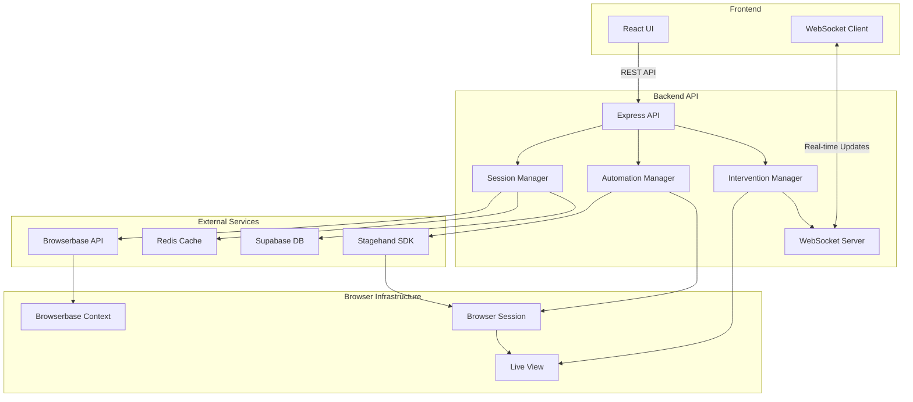

# LinkedIn Automation Backend Architecture

## System Overview

This document outlines the complete backend architecture for migrating from Browser Use to Stagehand + Browserbase, providing multi-tenant browser automation with human-in-the-loop intervention capabilities.

## Architecture Diagram



## Core Components

### 1. Session Management Layer

```typescript
// src/services/browserbase/SessionManager.ts
interface SessionManager {
  // Create isolated browser context for user
  createUserContext(userId: string): Promise<BrowserbaseContext>
  
  // Get or create session with persistence
  getOrCreateSession(userId: string): Promise<SessionInfo>
  
  // Session lifecycle management
  pauseSession(sessionId: string): Promise<PauseState>
  resumeSession(sessionId: string, pauseState: PauseState): Promise<void>
  terminateSession(sessionId: string): Promise<void>
  
  // Session state tracking
  getSessionStatus(sessionId: string): Promise<SessionStatus>
  updateSessionStatus(sessionId: string, status: SessionStatus): Promise<void>
}

interface BrowserbaseContext {
  contextId: string  // Pattern: user_{userId}_linkedin_context
  userId: string
  createdAt: Date
  lastUsed: Date
}

interface SessionInfo {
  sessionId: string
  browserbaseSessionId: string
  userId: string
  contextId: string
  status: SessionStatus
  liveViewUrl: string
  debugUrl: string
  wsUrl: string
  createdAt: Date
  expiresAt: Date
}

enum SessionStatus {
  NEW = 'new',
  PENDING = 'pending',
  RUNNING = 'running',
  PAUSED = 'paused',
  INTERVENTION_REQUIRED = 'intervention_required',
  COMPLETED = 'completed',
  ERROR = 'error'
}
```

### 2. Automation Engine

```typescript
// src/services/automation/AutomationEngine.ts
interface AutomationEngine {
  // Initialize Stagehand with session
  initializeStagehand(sessionId: string): Promise<Stagehand>
  
  // Intervention detection
  detectIntervention(): Promise<InterventionType | null>
  checkPageState(): Promise<PageState>
  
  // Task execution
  executeJobSearch(config: JobSearchConfig): Promise<void>
  executeJobApplication(jobId: string, config: ApplicationConfig): Promise<void>
  
  // State management
  saveState(): Promise<AutomationState>
  restoreState(state: AutomationState): Promise<void>
}

enum InterventionType {
  LOGIN = 'login',
  CAPTCHA = 'captcha',
  TWO_FACTOR = '2fa',
  ERROR_POPUP = 'error',
  UNEXPECTED_DIALOG = 'dialog',
  SESSION_EXPIRED = 'session_expired'
}

interface PageState {
  url: string
  title: string
  hasLoginForm: boolean
  hasCaptcha: boolean
  has2FA: boolean
  hasErrorMessage: boolean
  customChecks: Record<string, boolean>
}
```

### 3. API Layer (Browser Use Compatible)

```typescript
// src/routes/automation.routes.ts
router.post('/api/automation/linkedin/start', validateAuth, async (req, res) => {
  /**
   * Request Body (Browser Use Compatible):
   * {
   *   userId: string
   *   config: {
   *     jobTitle: string
   *     location: string
   *     experienceLevel: string[]
   *     jobType: string[]
   *     targetCount: number
   *     easyApplyOnly: boolean
   *     resumeId?: string
   *   }
   * }
   * 
   * Response (Browser Use Compatible):
   * {
   *   success: true,
   *   data: {
   *     taskId: string
   *     sessionId: string
   *     liveViewUrl: string
   *     status: 'running'
   *   }
   * }
   */
});

router.get('/api/automation/linkedin/status/:sessionId', validateAuth, async (req, res) => {
  /**
   * Response:
   * {
   *   success: true,
   *   data: {
   *     sessionId: string
   *     status: SessionStatus
   *     progress: {
   *       jobsSearched: number
   *       applicationsSubmitted: number
   *       targetCount: number
   *     }
   *     intervention: {
   *       required: boolean
   *       type?: InterventionType
   *       message?: string
   *       liveViewUrl?: string
   *     }
   *   }
   * }
   */
});

router.put('/api/automation/linkedin/pause/:sessionId', validateAuth, async (req, res) => {
  /**
   * Response:
   * {
   *   success: true,
   *   message: 'Automation paused'
   * }
   */
});

router.put('/api/automation/linkedin/resume/:sessionId', validateAuth, async (req, res) => {
  /**
   * Response:
   * {
   *   success: true,
   *   message: 'Automation resumed'
   * }
   */
});

router.delete('/api/automation/linkedin/stop/:sessionId', validateAuth, async (req, res) => {
  /**
   * Response:
   * {
   *   success: true,
   *   message: 'Automation stopped'
   * }
   */
});

router.post('/api/automation/linkedin/upload', validateAuth, upload.single('resume'), async (req, res) => {
  /**
   * Response:
   * {
   *   success: true,
   *   data: {
   *     fileId: string
   *     fileName: string
   *     fileUrl: string
   *   }
   * }
   */
});
```

## Database Schema

### New Tables Required

```sql
-- Browser sessions with isolation
CREATE TABLE browserbase_sessions (
  id UUID PRIMARY KEY DEFAULT gen_random_uuid(),
  user_id UUID NOT NULL REFERENCES profiles(user_id),
  browserbase_session_id TEXT NOT NULL UNIQUE,
  context_id TEXT NOT NULL, -- Pattern: user_{userId}_linkedin_context
  status TEXT NOT NULL DEFAULT 'new',
  live_view_url TEXT,
  debug_url TEXT,
  ws_url TEXT,
  expires_at TIMESTAMPTZ NOT NULL,
  created_at TIMESTAMPTZ DEFAULT NOW(),
  updated_at TIMESTAMPTZ DEFAULT NOW()
);

-- Intervention logs for human-in-the-loop
CREATE TABLE intervention_logs (
  id UUID PRIMARY KEY DEFAULT gen_random_uuid(),
  session_id UUID NOT NULL REFERENCES browserbase_sessions(id),
  user_id UUID NOT NULL REFERENCES profiles(user_id),
  intervention_type TEXT NOT NULL,
  detected_at TIMESTAMPTZ DEFAULT NOW(),
  resolved_at TIMESTAMPTZ,
  resolved_by TEXT, -- 'user' or 'system'
  page_url TEXT,
  page_state JSONB,
  resolution_data JSONB,
  created_at TIMESTAMPTZ DEFAULT NOW()
);

-- Pause states for resume functionality
CREATE TABLE automation_pause_states (
  id UUID PRIMARY KEY DEFAULT gen_random_uuid(),
  session_id UUID NOT NULL REFERENCES browserbase_sessions(id),
  automation_task_id UUID REFERENCES automation_tasks(id),
  pause_reason TEXT NOT NULL,
  page_url TEXT NOT NULL,
  page_state JSONB NOT NULL,
  stagehand_state JSONB,
  cookies JSONB,
  local_storage JSONB,
  session_storage JSONB,
  created_at TIMESTAMPTZ DEFAULT NOW(),
  resumed_at TIMESTAMPTZ
);

-- Applied jobs tracking
CREATE TABLE applied_jobs (
  id UUID PRIMARY KEY DEFAULT gen_random_uuid(),
  user_id UUID NOT NULL REFERENCES profiles(user_id),
  automation_task_id UUID REFERENCES automation_tasks(id),
  job_id TEXT NOT NULL,
  company_name TEXT NOT NULL,
  job_title TEXT NOT NULL,
  job_url TEXT NOT NULL,
  application_type TEXT NOT NULL, -- 'easy_apply' or 'external'
  applied_at TIMESTAMPTZ DEFAULT NOW(),
  status TEXT DEFAULT 'submitted',
  response_data JSONB,
  UNIQUE(user_id, job_id)
);

-- Update automation_sessions table
ALTER TABLE automation_sessions 
ADD COLUMN browserbase_session_id UUID REFERENCES browserbase_sessions(id),
ADD COLUMN intervention_count INTEGER DEFAULT 0,
ADD COLUMN last_intervention_at TIMESTAMPTZ;

-- Indexes for performance
CREATE INDEX idx_browserbase_sessions_user_id ON browserbase_sessions(user_id);
CREATE INDEX idx_browserbase_sessions_status ON browserbase_sessions(status);
CREATE INDEX idx_intervention_logs_session_id ON intervention_logs(session_id);
CREATE INDEX idx_intervention_logs_type ON intervention_logs(intervention_type);
CREATE INDEX idx_applied_jobs_user_id ON applied_jobs(user_id);
CREATE INDEX idx_applied_jobs_automation_task_id ON applied_jobs(automation_task_id);
```

## Implementation Details

### 1. Session Isolation

```typescript
// src/services/browserbase/BrowserbaseService.ts
export class BrowserbaseService {
  private browserbase: Browserbase;
  private contexts = new Map<string, ContextInfo>();

  async createUserContext(userId: string): Promise<string> {
    // Create isolated context ID
    const contextId = `user_${userId}_linkedin_context`;
    
    // Store context info
    this.contexts.set(userId, {
      contextId,
      createdAt: new Date(),
      lastUsed: new Date()
    });

    return contextId;
  }

  async createSession(userId: string): Promise<SessionInfo> {
    const contextId = await this.createUserContext(userId);
    
    // Create Browserbase session
    const session = await this.browserbase.createSession({
      projectId: process.env.BROWSERBASE_PROJECT_ID!,
      // Session isolation happens automatically in Browserbase
      // Each session is isolated by default
    });

    // Get debug URL for live viewing
    const debugInfo = await this.getDebugUrl(session.id);

    // Save to database
    await this.saveSession({
      userId,
      browserbaseSessionId: session.id,
      contextId,
      liveViewUrl: debugInfo.debuggerFullscreenUrl,
      status: 'new'
    });

    return {
      sessionId: session.id,
      liveViewUrl: debugInfo.debuggerFullscreenUrl,
      wsUrl: `wss://connect.browserbase.com?apiKey=${process.env.BROWSERBASE_API_KEY}&sessionId=${session.id}`
    };
  }
}
```

### 2. Intervention Detection

```typescript
// src/services/automation/InterventionDetector.ts
export class InterventionDetector {
  constructor(private stagehand: Stagehand) {}

  async detectIntervention(): Promise<InterventionResult | null> {
    // Use Stagehand's observe to check page state
    const observations = await this.stagehand.observe({
      instruction: `
        Check the current page for these conditions:
        1. Is there a login form visible?
        2. Is there a CAPTCHA present?
        3. Is there a 2FA/verification code prompt?
        4. Are there any error messages or unexpected popups?
        5. Has the session expired?
        
        Return detailed information about any interventions needed.
      `
    });

    // Analyze observations
    for (const observation of observations) {
      if (observation.description.toLowerCase().includes('login')) {
        return { type: InterventionType.LOGIN, element: observation };
      }
      if (observation.description.toLowerCase().includes('captcha')) {
        return { type: InterventionType.CAPTCHA, element: observation };
      }
      if (observation.description.toLowerCase().includes('verification') || 
          observation.description.toLowerCase().includes('2fa')) {
        return { type: InterventionType.TWO_FACTOR, element: observation };
      }
      if (observation.description.toLowerCase().includes('error')) {
        return { type: InterventionType.ERROR_POPUP, element: observation };
      }
    }

    // Additional checks using page evaluation
    const pageChecks = await this.stagehand.page.evaluate(() => {
      return {
        hasPasswordField: !!document.querySelector('input[type="password"]'),
        hasCaptchaFrame: !!document.querySelector('iframe[src*="captcha"]'),
        hasErrorAlert: !!document.querySelector('[role="alert"], .error, .alert-danger'),
        currentUrl: window.location.href
      };
    });

    if (pageChecks.hasPasswordField && !this.isLoggedIn) {
      return { type: InterventionType.LOGIN, pageChecks };
    }

    return null;
  }
}
```

### 3. Pause/Resume Implementation

```typescript
// src/services/automation/StateManager.ts
export class StateManager {
  async pauseAutomation(sessionId: string, reason: string): Promise<PauseState> {
    const stagehand = this.sessions.get(sessionId)?.stagehand;
    if (!stagehand) throw new Error('No active session');

    // Capture current state
    const currentState: PauseState = {
      url: await stagehand.page.url(),
      cookies: await stagehand.page.context().cookies(),
      localStorage: await stagehand.page.evaluate(() => {
        const items: Record<string, string> = {};
        for (let i = 0; i < localStorage.length; i++) {
          const key = localStorage.key(i);
          if (key) items[key] = localStorage.getItem(key) || '';
        }
        return items;
      }),
      sessionStorage: await stagehand.page.evaluate(() => {
        const items: Record<string, string> = {};
        for (let i = 0; i < sessionStorage.length; i++) {
          const key = sessionStorage.key(i);
          if (key) items[key] = sessionStorage.getItem(key) || '';
        }
        return items;
      }),
      timestamp: Date.now(),
      reason
    };

    // Save to database
    await this.savePauseState(sessionId, currentState);

    // Update session status
    await this.updateSessionStatus(sessionId, SessionStatus.PAUSED);

    return currentState;
  }

  async resumeAutomation(sessionId: string): Promise<void> {
    const pauseState = await this.getPauseState(sessionId);
    if (!pauseState) throw new Error('No pause state found');

    // Reconnect to session
    const stagehand = await this.reconnectToSession(sessionId);

    // Restore state
    await stagehand.page.goto(pauseState.url);
    await stagehand.page.context().addCookies(pauseState.cookies);
    
    // Restore storage
    await stagehand.page.evaluate((state) => {
      // Restore localStorage
      Object.entries(state.localStorage).forEach(([key, value]) => {
        localStorage.setItem(key, value);
      });
      // Restore sessionStorage
      Object.entries(state.sessionStorage).forEach(([key, value]) => {
        sessionStorage.setItem(key, value);
      });
    }, { 
      localStorage: pauseState.localStorage, 
      sessionStorage: pauseState.sessionStorage 
    });

    // Update status
    await this.updateSessionStatus(sessionId, SessionStatus.RUNNING);
  }
}
```

### 4. WebSocket Real-time Updates

```typescript
// src/websocket/AutomationWebSocket.ts
export class AutomationWebSocket {
  private io: Server;
  private sessions = new Map<string, Set<string>>();

  constructor(server: http.Server) {
    this.io = new Server(server, {
      cors: {
        origin: process.env.FRONTEND_URL,
        credentials: true
      }
    });

    this.setupHandlers();
  }

  private setupHandlers() {
    this.io.on('connection', (socket) => {
      socket.on('subscribe', async ({ sessionId, userId }) => {
        // Verify user owns session
        const isOwner = await this.verifySessionOwnership(userId, sessionId);
        if (!isOwner) {
          socket.emit('error', { message: 'Unauthorized' });
          return;
        }

        // Join room
        socket.join(`session:${sessionId}`);
        socket.emit('subscribed', { sessionId });

        // Send initial status
        const status = await this.getSessionStatus(sessionId);
        socket.emit('status', status);
      });

      socket.on('unsubscribe', ({ sessionId }) => {
        socket.leave(`session:${sessionId}`);
      });
    });
  }

  // Emit events
  sendInterventionRequired(sessionId: string, intervention: InterventionInfo) {
    this.io.to(`session:${sessionId}`).emit('intervention_required', {
      type: intervention.type,
      message: intervention.message,
      liveViewUrl: intervention.liveViewUrl,
      timestamp: Date.now()
    });
  }

  sendProgress(sessionId: string, progress: ProgressInfo) {
    this.io.to(`session:${sessionId}`).emit('progress', progress);
  }

  sendLog(sessionId: string, message: string, level: 'info' | 'warn' | 'error' = 'info') {
    this.io.to(`session:${sessionId}`).emit('log', {
      message,
      level,
      timestamp: Date.now()
    });
  }

  sendStatusUpdate(sessionId: string, status: SessionStatus) {
    this.io.to(`session:${sessionId}`).emit('status_update', { status });
  }
}
```

## Security Model

### 1. User Isolation

- Each user gets a unique context ID: `user_{userId}_linkedin_context`
- Sessions are isolated at the Browserbase level
- No shared browser state between users
- Session IDs are validated against user ownership

### 2. API Security

```typescript
// src/middleware/auth.ts
export const validateSessionOwnership = async (req: Request, res: Response, next: NextFunction) => {
  const { sessionId } = req.params;
  const userId = req.user.id;

  const session = await db.browserbase_sessions.findOne({
    where: { 
      browserbase_session_id: sessionId,
      user_id: userId 
    }
  });

  if (!session) {
    return res.status(403).json({ 
      success: false, 
      error: 'Forbidden: You do not own this session' 
    });
  }

  req.session = session;
  next();
};
```

### 3. Data Protection

- Sensitive data (cookies, localStorage) encrypted at rest
- Session data expires after 30 days
- Intervention logs sanitized before storage
- No LinkedIn credentials stored

## Error Handling Strategy

### 1. Error Categories

```typescript
enum ErrorCategory {
  BROWSER_ERROR = 'browser_error',
  NETWORK_ERROR = 'network_error',
  INTERVENTION_TIMEOUT = 'intervention_timeout',
  SESSION_EXPIRED = 'session_expired',
  AUTOMATION_ERROR = 'automation_error',
  RATE_LIMIT = 'rate_limit'
}

interface ErrorHandler {
  category: ErrorCategory;
  handler: (error: Error, context: ErrorContext) => Promise<ErrorResolution>;
  retryable: boolean;
  maxRetries: number;
}
```

### 2. Recovery Strategies

```typescript
export class ErrorRecoveryService {
  async handleError(error: Error, context: ErrorContext): Promise<void> {
    // Log error with context
    await this.logError(error, context);

    // Take screenshot for debugging
    if (context.stagehand) {
      const screenshot = await context.stagehand.screenshot();
      await this.saveDebugInfo(screenshot, error, context);
    }

    // Determine recovery strategy
    const strategy = this.getRecoveryStrategy(error);

    switch (strategy) {
      case RecoveryStrategy.RETRY:
        await this.retryWithBackoff(context);
        break;
      
      case RecoveryStrategy.PAUSE_FOR_INTERVENTION:
        await this.pauseForIntervention(context);
        break;
      
      case RecoveryStrategy.RESTART_SESSION:
        await this.restartSession(context);
        break;
      
      case RecoveryStrategy.FAIL:
        await this.failGracefully(context);
        break;
    }
  }
}
```

## Performance Optimizations

### 1. Session Pooling

```typescript
export class SessionPool {
  private availableSessions: Map<string, PooledSession> = new Map();
  private activeSessions: Map<string, PooledSession> = new Map();

  async getSession(userId: string): Promise<PooledSession> {
    // Check for available session
    const available = this.findAvailableSession(userId);
    if (available) {
      this.activeSessions.set(available.id, available);
      return available;
    }

    // Create new session
    return await this.createPooledSession(userId);
  }

  async releaseSession(sessionId: string): Promise<void> {
    const session = this.activeSessions.get(sessionId);
    if (session && session.reusable) {
      // Clear sensitive data
      await this.clearSessionData(session);
      
      // Move to available pool
      this.availableSessions.set(session.id, session);
      this.activeSessions.delete(sessionId);
    }
  }
}
```

### 2. Caching Strategy

```typescript
// Redis caching for session state
export class SessionCache {
  private redis: Redis;

  async cacheSessionState(sessionId: string, state: any): Promise<void> {
    await this.redis.setex(
      `session:${sessionId}:state`,
      300, // 5 minute TTL
      JSON.stringify(state)
    );
  }

  async getCachedState(sessionId: string): Promise<any | null> {
    const cached = await this.redis.get(`session:${sessionId}:state`);
    return cached ? JSON.parse(cached) : null;
  }
}
```

## Monitoring & Observability

### 1. Metrics

```typescript
interface AutomationMetrics {
  // Session metrics
  sessionsCreated: Counter;
  sessionsActive: Gauge;
  sessionDuration: Histogram;
  
  // Intervention metrics
  interventionsDetected: Counter;
  interventionResolutionTime: Histogram;
  interventionTypes: Counter; // by type
  
  // Application metrics
  jobsSearched: Counter;
  applicationsSubmitted: Counter;
  applicationSuccessRate: Gauge;
  
  // Error metrics
  errorsTotal: Counter;
  errorsByType: Counter;
  recoveryAttempts: Counter;
}
```

### 2. Logging

```typescript
// Structured logging
logger.info('Automation started', {
  sessionId,
  userId,
  jobTitle: config.jobTitle,
  location: config.location,
  targetCount: config.targetCount
});

logger.warn('Intervention detected', {
  sessionId,
  interventionType,
  pageUrl,
  timestamp: Date.now()
});

logger.error('Automation failed', {
  sessionId,
  error: error.message,
  stack: error.stack,
  context
});
```

## Migration Checklist

- [ ] Set up Browserbase project and API keys
- [ ] Implement SessionManager with user isolation
- [ ] Create AutomationEngine with Stagehand integration  
- [ ] Build API endpoints matching Browser Use interface
- [ ] Implement WebSocket server for real-time updates
- [ ] Create intervention detection and handling
- [ ] Build pause/resume state management
- [ ] Set up error handling and recovery
- [ ] Implement session pooling for cost optimization
- [ ] Add comprehensive logging and monitoring
- [ ] Create database migrations
- [ ] Test with multiple concurrent users
- [ ] Verify security isolation between users
- [ ] Performance testing and optimization
- [ ] Documentation and deployment guide

## Cost Considerations

1. **Browserbase Pricing**: Pay per minute of browser time
2. **Session Reuse**: Implement pooling to minimize costs
3. **Timeout Management**: Set appropriate session timeouts
4. **Intervention Handling**: Quick resolution reduces browser time
5. **Monitoring**: Track usage patterns for optimization

## Success Metrics

- User session isolation: 100% separation
- Intervention detection accuracy: >95%
- Pause/resume success rate: >99%
- Average intervention resolution time: <2 minutes
- Session reuse rate: >60%
- Cost per automation: <$0.50